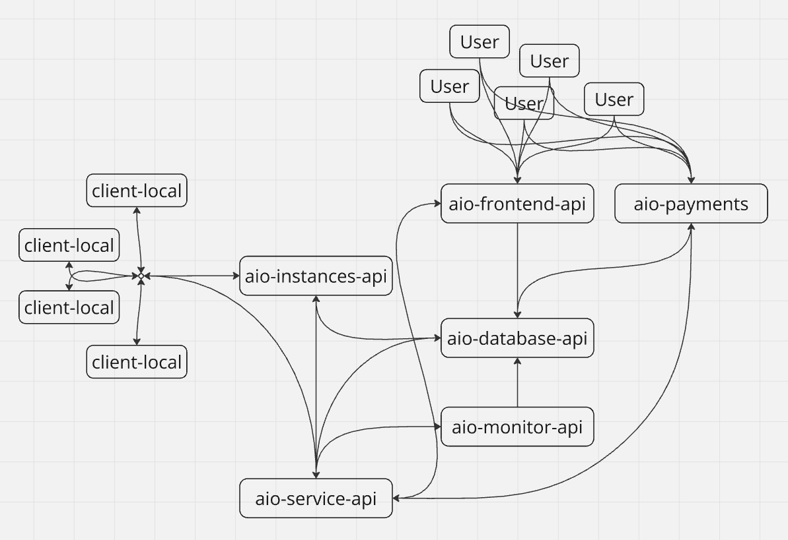
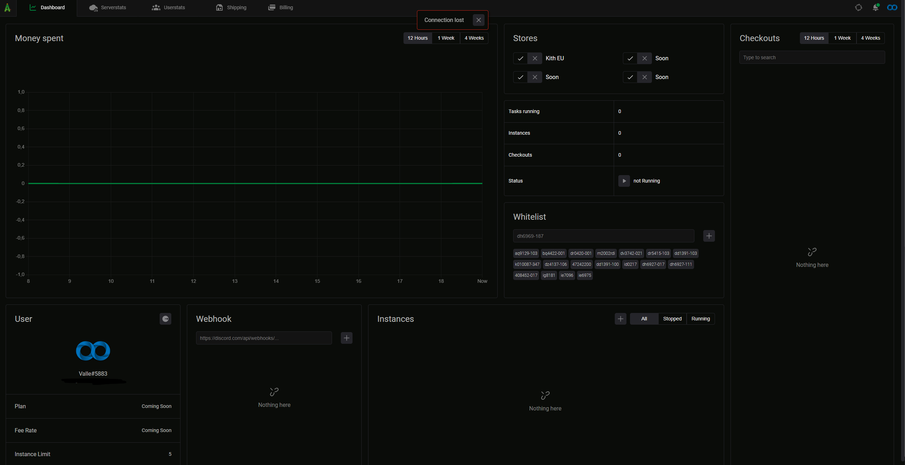
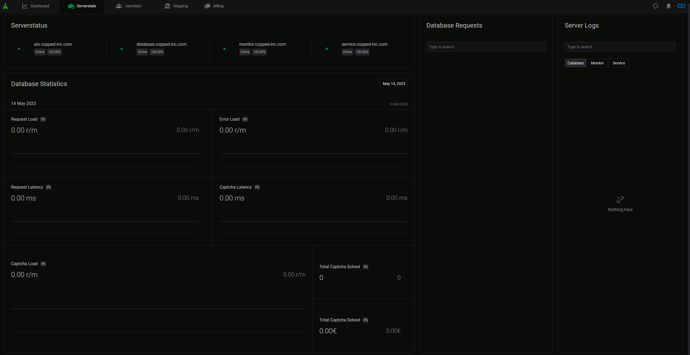
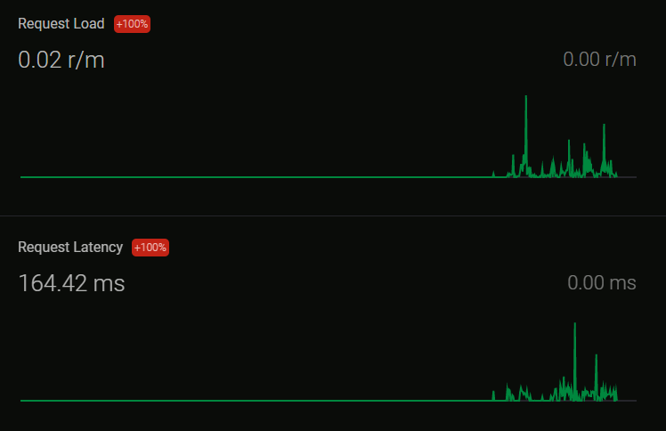
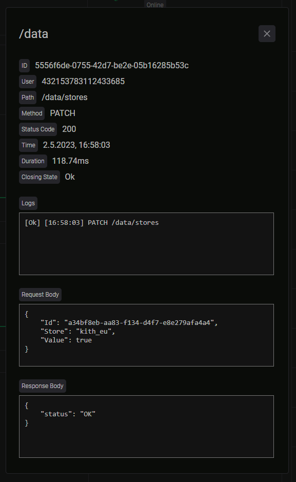
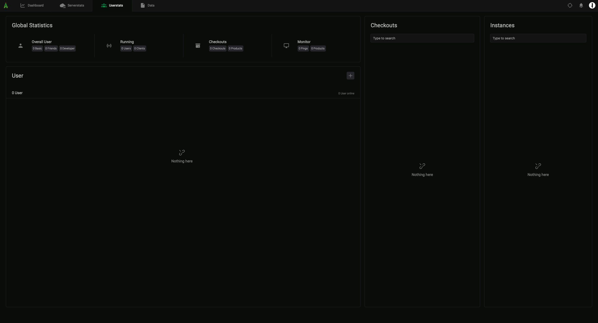
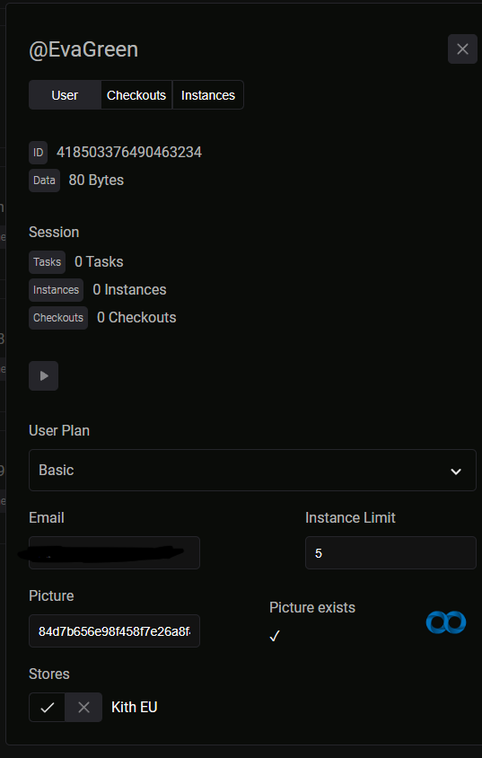
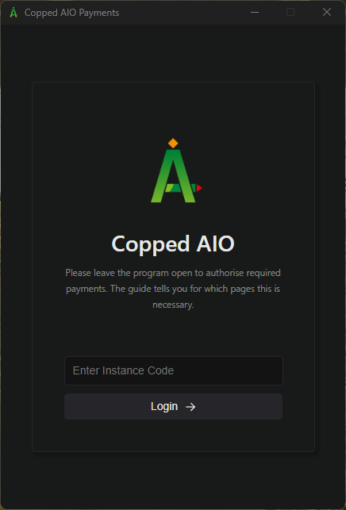
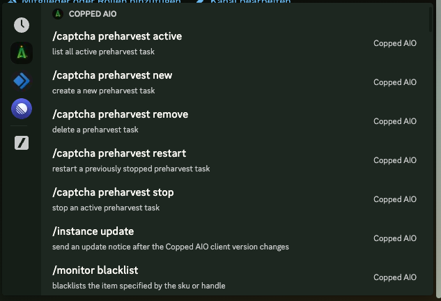
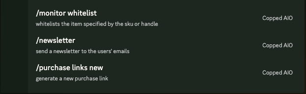

# Project Copped AIO
### First & only no-config, cloud-based Sneaker Bot

## Introduction
This is a project I worked on nearly non-stop from May 2022 to the middle of 2023. Unfortunately, this bot never went live due to the downturn in the sneaker industry and the workload required to make the project viable.

## Unique Selling Points of Copped AIO
I was tired of the repetitive nature of new sneaker bots and wanted to create my own with unique features to enhance user experience. Here are the key points:
- **No configuration**: Users don't have to set up anything, just log in and press start.
- **No task creation**: The bot picks up good products by itself and checks them out for users.
- **No profile/account creation**: Users only need to upload some credit cards and shipping information. The bot handles account generation, jigging, etc.
- **No captcha solving**: Users can sit back and relax while the bot solves captchas for them.

In essence, I aimed to create a bot where users don't have to do anything.

And then I started coding...

## Technologies
- **Frontend**: HTML / CSS / JS (because fuck Frameworks)
- **Backend**: Golang
- **Client**: Rust (this shit is so fast I love it)

## Structure

#### Explanation:
- **aio-frontend-api**: The main frontend interface for users to interact with the bot.
  - Fully responsive.
  - Includes an admin dashboard for monitoring user and server activity.
  - Like a low-budget Datadog (I wasn't aware of Datadog at the time).

- **aio-database-api**: The central API that interacts with the database.
  - Handles:
    - Frontend changes/requests.
    - WebSocket connections (e.g., to send products to clients).
    - Payment system (was planned to charge according to checkouts, though this wasn't fully operational).
    - Checkout system to handle releases like Hyper/Whop.

- **aio-monitor-api**: Monitors supported sites and sends good items to the aio-database-api.
  - Monitors supported sites.
  - Initially included a StockX monitor to check prices, which was later replaced with a simple keyword monitor.
  - Includes an experimental AI feature for personal use (not recommended for investment due to inconsistent performance).

- **aio-instances-api**: Manages clients when users run tasks on the cloud.
  - Handles spawning, updating, and deleting clients.

- **client-local**: The main bot that executes tasks and checks out sneakers and other items.
  - Three versions with different modules:
    - **aio-client** (deprecated) - Modules: KithEU, Shopify.
    - **aio-client-v2** (deprecated) - Modules: KithEU, AboutYou.
    - **aio-client-v3** - Modules: KithEU, QueueIt.

- **aio-payments**: Handles checkout processes that require real user interaction (e.g., 3D Secure confirmations).
  - Users can download this client to handle checkouts, even with a delay.

- **aio-service-api**: Functions as a CDN to provide proxies and checks if services are down.
  - Monitors uptime of other APIs and provides basic functionalities.

There are many more details, but this covers the main points.

Special thanks to my very good friend [Valle](https://github.com/valdotle) who helped with functions like WebSocket pool handling, Stripe implementation, a custom Discord bot & library, and more.

## Frontend Screenshots
Unfortunately, I only have some old pictures of the frontend parts, where some features didn't work, but you should get the idea.

#### Dashboard

#### Admin Server Page

#### Admin User Page

#### Payments Client

#### Discord Bot Functions

## Final Notes for Future Development
- Each folder is a separate GitHub repo.
- Search globally for `INSERT` to find placeholders that need replacement.
- No env files are needed.
- The module 'github.com/Copped-Inc/aio-types' is a package you can find in /aio-types.
  - This package is needed in every repo.
- /aio-database-api is not fully updated!